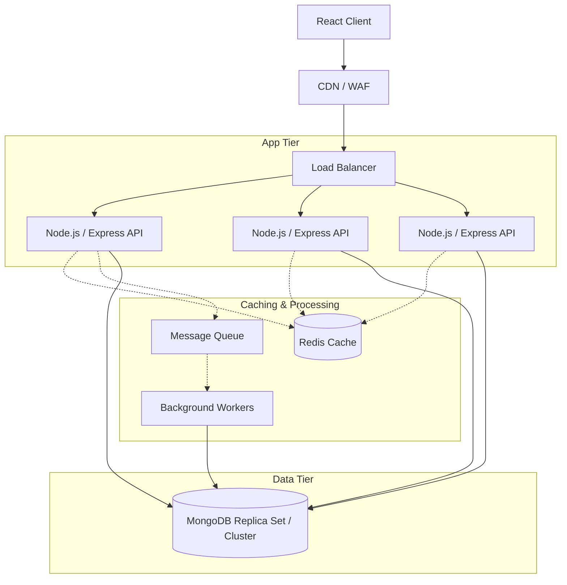

# ShelfLife Library Management System: System Design

This document outlines the scalable architecture and design decisions for the ShelfLife Library Management System, specifically geared towards handling high concurrency and semester-driven traffic spikes.

## 1. High-Level Architecture & Diagram

The system follows a modern, decoupled web architecture, isolating the presentation layer from the core business logic and persistence tiers.



### Client, API, and Load Balancer
The frontend is a **React SPA** served globally via a **CDN (Content Delivery Network)**, ensuring rapid static asset delivery and utilizing a **WAF (Web Application Firewall)** to filter malicious traffic. API requests hit a **Load Balancer**, which acts as a reverse proxy, distributing incoming traffic across a horizontally scaled pool of **Node.js/Express API** instances. This allows the application tier to scale dynamically as connection volumes fluctuate.

## 2. MongoDB Architecture & Sharding Strategy

### Replication and Initial Scaling
For initial deployment, a single MongoDB Replica Set (one primary, multiple secondaries) is sufficient to ensure high availability and read-scaling. Write operations are directed to the primary, while read-heavy operations can be routed to secondaries if eventual consistency is acceptable. 

### Sharding Strategy
As data volume grows across multiple college campuses, vertical scaling will hit physical limits, making sharding necessary. 

A naive approach might partition by `campusId` to enforce data localization. However, `campusId` alone is a low-cardinality shard key; a few large campuses could cause massive chunk imbalances and hot shards. 
**Recommended Strategy:** 
- For the **Books** and **Members** collections, a compound shard key like `{ campusId: 1, _id: 1 }` ensures data is naturally grouped by campus for efficient tenant-aware queries, while maintaining high cardinality to distribute data evenly within that campus.
- For **BorrowRecords**, `{ campusId: 1, memberId: 1 }` ensures that retrieving a specific member's borrowing history—a common access pattern—is a targeted, routed query rather than a scatter-gather operation across all shards.

## 3. Redis Caching

The `GET /api/books` endpoint is the most read-heavy operation in the system, especially during catalog browsing. Routing every search to MongoDB is highly inefficient. We introduce a Redis caching layer to offload these reads.

- **Cache Key:** `books:catalog:page:{page}:limit:{limit}:genre:{genre}:search:{searchString}`
- **Cached Data:** The serialized JSON array of books and pagination metadata.
- **TTL (Time to Live):** 10–15 minutes. This ensures stale inventory data ages out relatively quickly.
- **Cache Miss Behavior:** If the key is not in Redis, the API queries MongoDB, serializes the response, stores it in Redis with the TTL, and then returns the data to the client.
- **Invalidation Triggers:** When a new book is added, or an existing book is issued/returned (altering `availableCopies`), we execute targeted cache invalidations (e.g., matching and purging the `books:catalog:*` pattern) to ensure the catalog accurately reflects availability.

## 4. Issue-Book Concurrency

Handling concurrent checkouts for a popular textbook is a critical challenge. If two students request the last available copy at the exact same millisecond, the system must not assign the same copy twice or drop `availableCopies` below zero.

**Atomic Conditional Updates:**
Instead of fetching the book, calculating `availableCopies - 1` in application memory, and saving it, we push the constraint to the database layer using an atomic conditional update:
```javascript
const updatedBook = await Book.findOneAndUpdate(
  { _id: bookId, availableCopies: { $gt: 0 } },
  { $inc: { availableCopies: -1 } },
  { new: true }
);
```
This guarantees that the update only succeeds if a copy is actually available at the exact moment the write executes natively in the database, preventing negative inventory logic races.

**Transactions:**
To keep the inventory deduction strictly consistent with the creation of the `BorrowRecord`, these two operations must be wrapped in a MongoDB ACID Transaction. If the `BorrowRecord` insertion fails, the `$inc` on the book is rolled back, guaranteeing no phantom inventory loss.

## 5. Queue & Background Processing

For tasks that do not need to block the immediate HTTP response, we implement a Message Queue (e.g., RabbitMQ or BullMQ via Redis) coupled with background workers.
- **Notifications:** Sending due-date reminder emails to members.
- **Status Updates:** A nightly cron job scanning for overdue books. Instead of locking the primary database, the job pushes member IDs to a queue, where decoupled workers update statuses to `overdue` and trigger penalty calculations asynchronously.

## 6. Semester Traffic Spike Handling

Library traffic is highly seasonal, peaking sharply at the start and end of semesters. Our architecture addresses this through:
1. **Horizontal Autoscaling:** The Node.js application tier is containerized. CPU/Memory metric triggers alert the orchestrator to spin up new API containers dynamically during registration weeks.
2. **Load Balancing:** Seamlessly distributes the massive influx of HTTP connections across these newly provisioned containers.
3. **Redis Caching:** Absorbs up to 90% of the read load for the catalog, shielding MongoDB from traffic spikes.
4. **MongoDB Scaling:** Read replicas are dynamically scaled out to absorb heavy analytical or un-cached read traffic.
5. **Queues:** Spikes in background tasks (like mass-emailing overdue notices at semester end) are decoupled into queues, preventing the main API from experiencing resource starvation.

## 7. Trade-offs

- **Consistency vs. Performance:** Aggressively caching the book catalog vastly improves read performance but introduces eventual consistency. A user might briefly see a book as "available" on the search page, only to be rejected at checkout if someone else just claimed the last copy.
- **Sharding Complexity:** Introducing a sharded MongoDB cluster drastically increases operational complexity and infrastructure costs compared to a single Replica Set.
- **Microservices vs. Monolith:** We maintain a modular monolith (a single Express API) rather than fully decoupling into microservices (e.g., separating Auth, Books, and Members). This reduces network latency and deployment complexity, making it ideal for the current scale, though it limits independent scaling of specific domains in the future.
